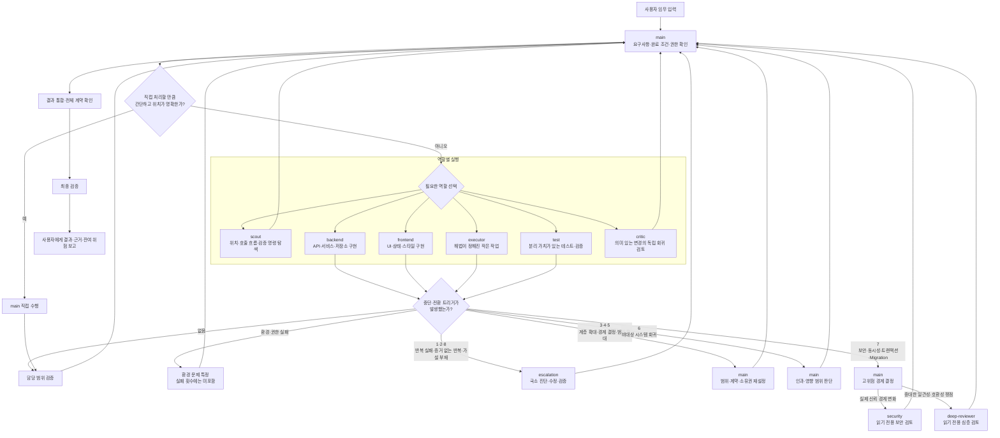
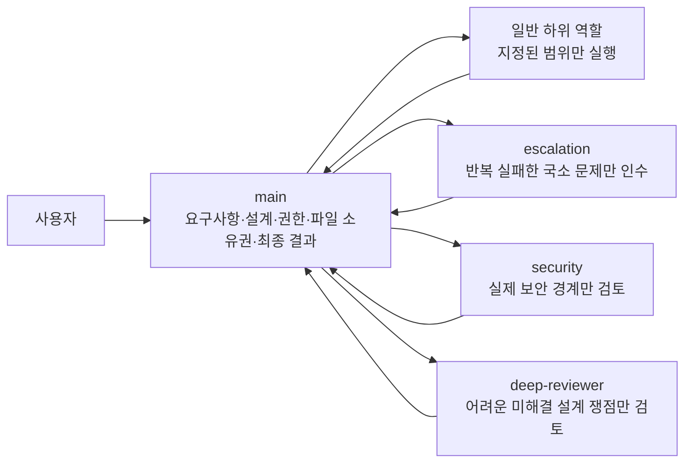

# 임무 수행 흐름

이 문서는 사용자 요청이 들어온 뒤 main이 작업을 분류하고, 필요한 역할에 위임하며, 중단·에스컬레이션·검증을 거쳐 최종 결과를 반환하는 흐름을 설명한다. 실제 모델과 추론 수준은 [`policy/models.toml`](../policy/models.toml)이 단일 원본이다.

## 소유권 구조

## 적용 원칙

- 모든 역할의 결과와 소유권은 main으로 돌아간다.
- 하위 역할끼리 직접 소유권을 넘기거나 재위임하지 않는다.
- 한 파일의 편집 담당자는 동시에 한 명이다.
- 기본 동시 하위 작업은 1~2개이며 설정 상한은 3개다.
- 에스컬레이션은 자동 감시 데몬이 아니라 역할 지침에 따른 명시적 편집 중단과 소유권 이관이다.
- escalation은 국소 문제까지만 처리하고, 해결 후 남은 일반 작업은 적절한 역할로 돌려준다.
- 모델 전환은 사용자 승인이나 파일·운영 권한을 확대하지 않는다.

상세 계약은 [`AGENTS.md`](../AGENTS.md)의 **Escalation and Deep Review**, 역할별 정의는 [`agents/`](../agents), 스킬 연결은 [`policy/skill-routing.toml`](../policy/skill-routing.toml)을 따른다.
